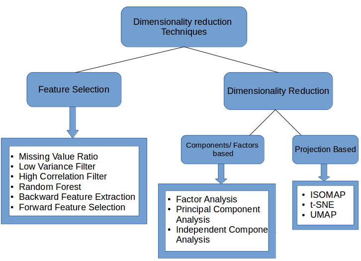

# Data Science - blood & tears
My experience while working in Data Science, so I don't have to relearn or reinvent any thing.

1. Early Stopping, but when?

According to [this paper](http://page.mi.fu-berlin.de/prechelt/Biblio/stop_tricks1997.pdf), slower stopping criteria allow for small
improvements in generalization (here: about 4% on average), but cost much more training time (here: about factor 4 longer on average).

2. No Free Lunch theorem as I understand it

If we have absolutely no knowledge or insights about the problem we intend to solve, which algorithm we choose doesn't matter.

3. Bayes error rate

In statistical classification, [Bayes error rate](https://en.wikipedia.org/wiki/Bayes_error_rate) is the lowest possible error rate for any classifier of a random outcome (into, for example, one of two categories) and is analogous to the irreducible error.

4. Common Dimension Reduction techniques

(Reference: https://www.analyticsvidhya.com/blog/2018/08/dimensionality-reduction-techniques-python/)



5. Use backslash escapes in f-strings

(Reference: https://realpython.com/python-f-strings/)

> As you saw earlier, it is possible for you to use backslash escapes in the string portion of an f-string. However, you can’t use backslashes to escape in the expression part of an f-string:

```
>>> f"{\"Hello World\"}"
  File "<stdin>", line 1
    f"{\"Hello World\"}"
                      ^
SyntaxError: f-string expression part cannot include a backslash
```

6. Compare notebooks for version control

Use [nbdime](https://nbdime.readthedocs.io/en/stable/#)

```
nbdiff notebook_1.ipynb notebook_2.ipynb
nbdiff-web notebook_1.ipynb notebook_2.ipynb
```

7. Docker related problems

* Fix Docker error: request canceled while waiting for connection 

(Source: https://github.com/docker/kitematic/issues/2956)

Go to Docker settings > network > DNS server . change from automaic to fixed ( default is 8.8.8.8 )

* Cannot open localhost

```
docker run -it -p 8888:8888 image:version
```

* Kill all running containers

```
docker kill $(docker ps -q)
```

* Delete all stopped containers

```
docker rm $(docker ps -a -q)
```

* Delete all images

```
docker rmi $(docker images -q)
```

* Mount a host directory to a container (Windows)

```
docker run -v d:/data:/data alpine ls /data
```

* Access to a container's terminal

```
docker exec -it container_name /bin/bash
docker exec -it -u root container_name /bin/bash

```

* Install ping in Docker

```
apt update
apt install iputils-ping
```

8. Jupyter notebook tools

* facets: Data visualization
* papermill: Parameter settings
* nbconvert: convert notebooks to other formats

9. Close multiple Chrome windows with PowerShell

(Source: https://www.reddit.com/r/PowerShell/comments/5feoyx/one_liner_to_kill_chrome/)

```
Stop-Process -Name chrome
```
